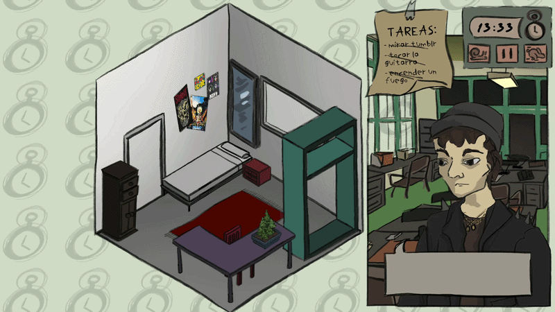

# Make Room For The Past

Our home inevitably reflects who we are and our circumstances, isn’t that precisely what makes it ours?

Decorate a person’s teenage bedroom to reflect who they’ve become today. Observe what they do throughout the day and have them perform specific actions to complete tasks. Or, simply decorate the room however you like and see how it affects them.

